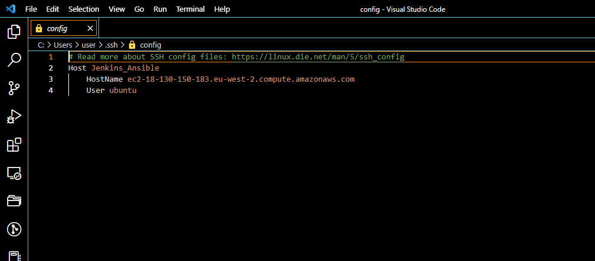

## **Project_11_Ansible-Automate-Project-7-10**___
____
### **Step 1 - Install & Configure Ansible & Setup Jenkins to Build Job from Repo**
___
>#### Edit the  existing EC2 instance with Ubuntu 20.04 Operating System for Jenkins and name it Jenkins_Ansible. 

>#### In your GitHub account create a new repository and name it ansible-config-mgt

>#### Install Ansible uisng the following commands;
* *`sudo apt update`* - (Updated Apt Packages)
* *`sudo apt install ansible`* -(Install Ansible)
* *`ansible --version`* - (To Check Ansible Version)

>#### Accessing the Jenkins Server 
The Server is access from Web Browser with url *`http://Jenkins-Server-Public-IP-Address-or-Public-DNS-Name:8080`* which is *`http://18.134.137.161:8080`*

### Configure Jenkins to retrieve source codes from GitHub using Webhooks
___
Here I will configure a simple Jenkins job/project. This job will will be triggered by GitHub webhooks and will execute a ‘build’ task to retrieve codes from GitHub and store it locally on Jenkins server.
>#### Enable webhooks 
In my GitHub repository settings I enable the webhooks settings.

>#### Create Jenkins Job
* On Jenkins web console, I clicked New Item and create a Freestyle project called "ansible", Press OK at the bottom.

 * In the Source Code management Tab I select Git and put the URL of tooling repository https://github.com/OlusegunMichael/ansible-config-mgt.git Click Save

 
 
Configuring  the job to trigger whenever there is a change in the sourcecode in Github's Repository

 * On In Build Triggers Tab  GitHub hook trigger for GITScm polling box is checked

 

* On Post-build Actions Tab  archive all the artifacts with 

* "Build Now" button is clicked, after all configuration is done correctly, the build will success will be displayed under #10

To confirm the Build Trigger on the job whenever there is a change in the sourcecode in Github's Repository I  make some change in any file in your GitHub repository (e.g. README.MD file) and push the changes to the master branch.
* "Build Now" button is clicked, after all configuration is done correctly, the build will success will be displayed under #11

By default, the artifacts are stored on Jenkins server locally *`ls /var/lib/jenkins/jobs/tooling_github/builds/<build_number>/archive/`*

___
### **Step 2 - Prepare your development environment using Visual Studio Code**
___

### Ansible Developments
___
* Setup the SSH Agent

Ansible uses TCP port 22 by default, which means it needs to ssh into target servers (nfs, db, webservers, lb)

Adding my key.pem file to ssh agent from downloads directory the following command was ran 
* *`eval `ssh-agent -s` `*
* *`ssh-add .\Tooling.pem`*

* Accessing the Jenkins Ansible Server by via VS code by modifing the Open SSH Config File to the server details and then connecting to the Host.

* Clone down your ansible-config-mgt repo to your Jenkins-Ansible instance using *`git clone git@github.com:OlusegunMichael/ansible-config-mgt.git`*

* In your ansible-config-mgt GitHub repository, I created a new branch that will be used for development of a new feature.

* 2 Directories named *"playbooks" and "inventory"* were created using *`mkdir playbooks && mkdir inventory`*
* In Directory playbooks, "*common.yml*" file was created using *`touch common.yml`* and in the inventory directory "*dev.yml, staging.yml, uat.yml, and prod.yml*" was created with *` touch dev.yml, staging.yml, uat.yml, and prod.yml`* was created.

* Updated the inventory/dev.yml to start configuring.

### Create a Common Playbook
___
It is time to start giving Ansible the instructions on what you needs to be performed on all servers listed in inventory/dev.

In common.yml playbook I will write configuration for repeatable, re-usable, and multi-machine tasks that is common to systems within the infrastructure.

* Update your playbooks/common.yml file with following code:

### Update GIT with the latest Code
---
 Commit your code into GitHub: Use git commands to add, commit and push your branch to GitHub.
 * *`git status`*
* *`git add .`* 
* *`git commit -m "first commit"`*

#### *A Pull request is created (PR)*

#### *The code is merged to the master branch*

#### *Jenkins Automatically Updates with another Job Build*

#### *All the files (build artifacts) to /var/lib/jenkins/jobs/ansible/builds/<build_number>/archive/ directory on Jenkins-Ansible server.*

### Run First Ansible Test
---
Now, it is time to execute ansible-playbook command and verify if your playbook actually works the following command was ran;

* *`cd ansible-config-mgt`* - Access the ansible-config0mgt directory. 
* *`ansible-playbook -i inventory/dev.yml playbooks/common.yml`* Runs the Playbook to implement the tassk detailed therein.

To confirm on the servers and if wireshark has been installed the below commands are used;
* *`which wireshark`*
* *`wireshark --version`*
* *`sudo yum list installed | grep wire`*

