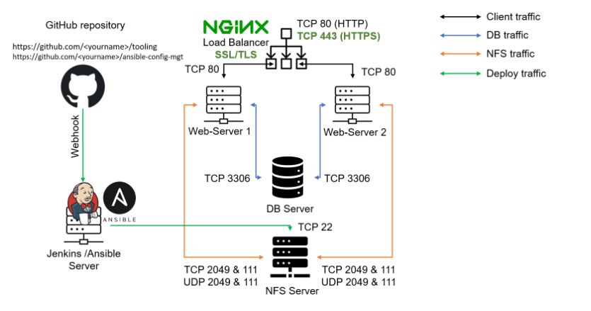

# Project_11_Ansible-Automate-Project-7-10
In this Project most routine tasks will be automated with Ansible Configuration Management, by writing code using declarative language such as YAML.
*Implementation will be done using the following steps with [**Project 7-10**](https://github.com/OlusegunMichael?tab=repositories) as a prerequisites:*
* [x] Install & Configure Ansible
* [x] Setup Jenkins to Build Job from the Repo Automatically

After the 2 Process above the arhitecture below is the ouput;

* [x] Ansible Development is Done
* [x] Common Playbook is Created
* [x] First Ansible test is ran

The final architecture is capture below;

